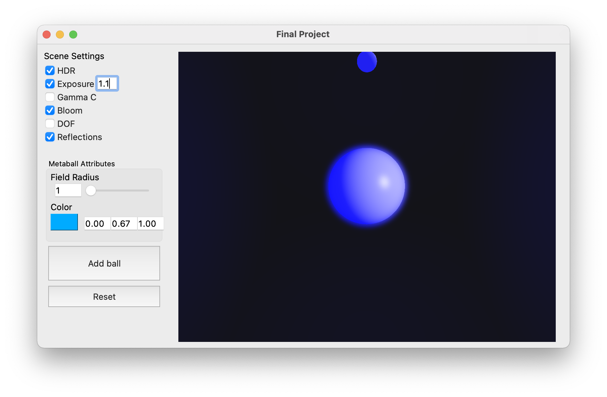

# Team Astro Globe

## Introduction

Our project centered around simulating a lava lamp-like environment, using colorful and glowy deforming shapes that move about the scene. Technical features were selected that would accentuate this theme and produce the desired visual effects.

## Features

- Metaballs
- GPU Ray Marching
- HDR and Bloom
- Depth of Field
- Reflections
- Emissive Lighting

## Running the Application

The program can be run using the provided QT Creator project. On startup, the following UI is presented and provides a number of options to change the appearance of the scene.

- HDR: toggles high dynamic range.
- Exposure: toggles exposure tone mapping for HDR. If unchecked, Reinhard tone mapping is used when HDR is enabled. If checked, the number indicates the exposure level for the scene.
- Gamma C: toggles gamma correction.
- Bloom: toggles bloom.
- DOF: toggles depth of field.
- Reflections: toggles reflections and emissive lighting.
- Field Radius: changes the field size of the next added metaball (after the first 3 metaballs).
- Color: changes the color of the next added metaball (after the first 3 metaballs).

## Notes

- The gamma correction and emissive lighting features are best not simultaneously enabled as they can lead to the scene becoming washed out/too bright.
- Depth of field looks more prominent if it is the only feature activated or DoF + Bloom. 

  
